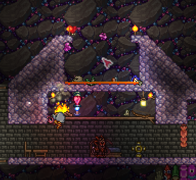

# iwantrodofdiscord

## A simple script to help you in your Terraria AFK farming endeavours.

Features include summoning minions every 30 seconds, resetting position with grappling and a config file to change your settings.

# How to set up

For this script, you will require a grappling hook and a rod of discord farm configured similar to designs [like this](https://www.youtube.com/watch?v=RyFxXi4xHgM).

Firstly, position yourself with your cursor above you, like so:

Then, configure your settings in `config.json` and run `main.py`. It will take 5 seconds to start.

When you wish to stop the script, press the ESC key.
